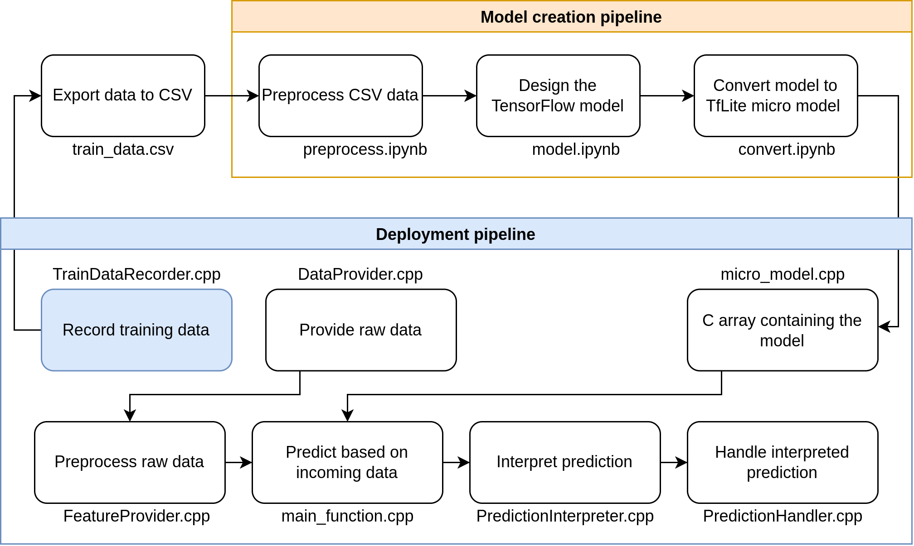

# Architecture

Our embedded architecture is based on the TinyML pipeline of [Pete Warden and Daniel Situnayake](https://tinymlbook.files.wordpress.com/2020/01/tflite_micro_preview.pdf).
Our changes are aimed at making the architecture more beginner friendly and converting code from a C-style to an OOP and C++11 based style.
Accordingly we use classes to pipe our data through the different stages of processing.

## [Components/](./components/README.md)

The folder `components/` contains all libraries we need for our project.

## [main/](./main/README.md)

Under `main/` you find the code that runs on the microcontroller during deployment.
We call this the deployment pipeline or embedded environment.
It’s a continuous cycle of receiving data from connected sensors, applying manipulations to the data (called preprocessing), making predictions, interpreting those and finally performing an action.

**TrainDataRecorder.cpp** 
Sensor data is recorded and written to file.
The saved data is then used to develop and train a model.

**DataProvider.cpp** 
The structure of DataProvider is similar to `TrainDataRecorder.cpp`; instead of writing to file, data is passed to the FeatureProvider class.
We use DataProvider during the deployment of a microcontroller while TrainDataRecorder is used before the model creation.

- `Init`: Initialize the MCU's sensors.
- `Read`: Read sensor data and pipe it to FeatureProvider.

**FeatureProvider.cpp** 
The FeatureProvider applies preprocessing to the data coming in from the DataProvider and forwards it to the model for prediction.

- `SetInputData`: Receive data from DataProvider.
- `ExtractFeatures`: Apply transformations onto data. The transformation must be the same transformation applied during the model creation as part of preprocessing. That is because a model can only understand data that is similar to its training data.
- `WriteDataToModel`: Pass transformed data to the TensorFlow model in order to make predictions.

**main.cpp** 
Main serves as entry point for FreeRTOS.
A task `tf_main` is created which is a wrapper around the functions `setup` and `loop`.
Both functions are inspired by the classic Arduino architecture.
This approach is mainly simple - not optimal.
Multiple FreeRTOS tasks - instead of one - can yield performance gains.

- `app_main`: FreeRTOS entry point.
- `tf_main`: Call `setup` and `loop` for Arduino style.

**micro_model.cpp** 
This file contains the converted TfLite model in the form of a C array.

**PredictionInterpreter.cpp** 
Within this file we interpret the raw result produced by the TfLite interpreter.
An example of this is mapping a numerical value to a semantic concept.
For example in a binary scenario a value <0.5 could mean no and a value >=0.5 would be interpreted as yes.

Consider the three-class scenario where

    class 1 has 0.56 probability
    class 2 has 0.33 probability
    class 3 has 0.65 probability

Apply maximum function over the list of results. This yields class 3. Now map the numerical result to a semantic concept.

    class 1 maps to apple
    class 2 maps to orange
    class 3 maps to pear

The prediction is pear.

- `GetResult`: Read the model's prediction and map numerical result to something meaningful.

**PredictionHandler.cpp** 
Depending on what kind of result PredictionInterpreter gives us, we may control actuators, interface with a Wifi network or send data to the cloud to visualize it with Grafana.

- `Update`: Act on model prediction. For example, apply actuator control.
 
**main_functions.cpp** 
Everything comes together here.
We define a setup and loop function as initialized in the `main.cpp` file.
This keeps things simple and in line with Arduino syntax.
Within the setup function we configure TfLite to read our model and we initialize periphery modules.
Within the loop function we call the data and feature providers to receive the sensor data in its desired shape. Then we pass the data to the TfLite interpreter we configured earlier.
The resulting prediction is passed to the prediction interpreter to get a result based on a threshold.
Afterwards we call the prediction handler to act on the result.
See this [README.md](/main/README.md) for more detailed documentation.

- `setup`: Configure TfLite and initialize periphery.
- `loop`: Execute iteration of super loop. Read data, predict with model and act on prediction.

## [model_creation/](./model_creation/README.md)

In this folder you find the model creation pipeline, where we use the data written by `TrainDataRecorder.cpp`.
This is done using the TensorFlow library in order to create a machine learning model.

**preprocess.ipynb** 
We use this file to preprocess our data and to split data into two sets; namely training and test data.

**model.ipynb** 
Here we design and train a machine learning model.

**convert.ipynb** 
This file converts the model from TensorFlow format to a TfLite format and lastly to a C array which contains all the information about the model.

## [scripts/](./scripts/README.md)

Scripts live here.

**update_components.sh** 
This script downloads dependencies for the embedded environment.

