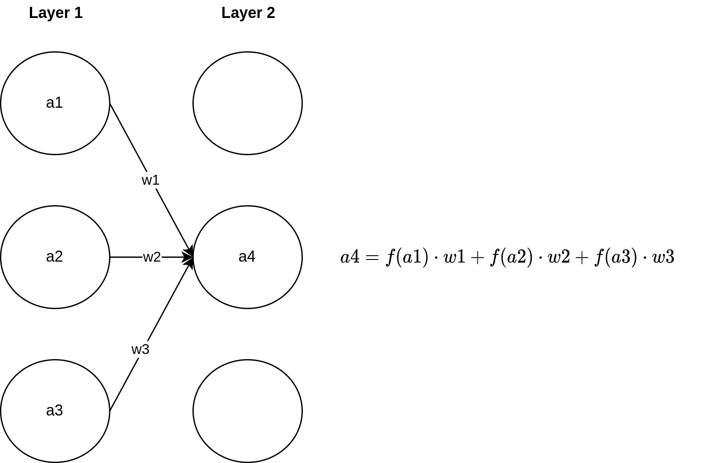

# Model creation

**Table of Contents:**

1. [General information](#generalinformation)
1. [Preprocesssing](#preprocessing)
1. [Model](#model)
1. [Model conversion](#model-conversion)
1. [main](#main)

---

## General information

This file will guide you through the model architecture built in python.
The architecture is chosen with simplicity mind; choosing an ideal architecture is non-trivial and is dealt with in the domain of [AutoML](https://en.wikipedia.org/wiki/Automated_machine_learning) and [neural architecture search](https://en.wikipedia.org/wiki/Neural_architecture_search) (NAS).
The figure below summarizes our project, and the flow of data.
 In this section we will focus on the model creation pipeline using TensorFlow. 

## Preprocessing

Within `preprocess.ipynb` you  find an example of how to prepare a given dataset.
Here we use the data from an accelerometer.
We recorded two movements.
For the first movement we hold the sensor in our hand to measure the idle state.
For the second movement we move the sensor in circles; we call this circle state.
We recorded each movement for at least 5 minutes.
If you don't have data available, you can enable the option to generate synthetic data.

Now we need to prepare the dataset in order to train the model.
After loading the data, we inspect our two classes which our AI should recognize later on; we do this by making two plots.
Both plots are clearly distinguishable.
You can find the plots in the `preprocess.ipynb` file.
Some patterns can be recognized with the naked eye.
But that isn't necessarily transferrable to the AI.
For example, normalized data is often easier for an AI to interpret.
This is the most basic preprocessing we can do.
You can extend this and apply many more.

- For example:
    - Fourier transform
    - one-hot encoding
    - median filter

Which methods you use depends on your data and what works well in experimentation.

> Note: Every preprocessing step done before training has to be applied on the MCU, too.

In order to load data it may be helpful to rely on [Keras tools](https://keras.io/api/data_loading/).
For example, the function `keras.utils.image_dataset_from_directory` is very convenient to organize and load image data.

## Model

After preprocessing you can start building your own AI.
Implementing AI algorithms from scratch is certainly possible, however when it gets to hardware acceleration, that'a a different kind of beast.
For this reason we use the TensorFlow framework; it's quite popular.
In the file `model.ipynb` you  find an exemplary model.
An AI model is based on different layers, when combined they can recognize patterns within data.

### Dense layers

The most basic network layer is called a fully-connected or dense layer.
It can do everything a little bit and nothing too well.
We can think of an individual layer as a series of neurons.
From biology you may recall that a single neuron has an electric potential associated with it. 
The virtual neurons in the dense layer have something similar, namely an activation level.
The activation of a single neuron changes with the signal that is fed to it.
Consider the figure above, here the activation of the neuron denoted with `a4` is the result of the three neurons in the layer before it.
Each connection between neurons has a weight to it that describes how intense the connection between neurons is.
Above, the weights are denoted by `w` and they are multiplied with the activation of neurons.
The right hand equation defines that `a4` is the sum of activations of the neurons that connect to it.
There is one more thing, the activation function, denote `f()` in the figure above.
The activation function is modifies the activation level of a neuron.
An example of a classic activation function is the sinusoidal function.
It shifts the activation of each neuron, to which it's applied, into the interval -1 to 1.

### Convolutional layers

Convolutional layers are your bread and butter when dealing with image data.
Convolution is a mathematical operation common in signal processing.
A classic example is the Sobel edge detection filter.
For our purpose, applying filters to images reduces their dimensionality, extracts important patterns and preserves local relationships between pixels.
An example of such a filter could be edges as detected by something like a Sobel filter.
In a neural network context the term convolutional neural network (CNN) is used to describe a neural network with convolutional layers.

### Time-series

Are you dealing with a time series problem such as language?
Consider that for language data you may wish to capture the dependency between a given word and those said before and after it.
So we need some kind of memory.
Layers that come in handy are the [RNN](https://keras.io/api/layers/recurrent_layers/rnn/) or [LSTM](https://keras.io/api/layers/recurrent_layers/lstm/) layers.
Those acronyms stand for Recurrent Neural Net and Long Short Term Memory; these layers have connections to themselves and by that account can remember things across multiple time steps.

For our problem of classifying wand movements we also need to consider time.
However instead of using a RNN we consider the accelerometer signals of a fixed time frame as a kind of image.
This enables us to use a CNN which is simpler to work with than a RNN.
On the downside, we must use the same sampling rate during data collection and later for deployment.
Furthermore, movements that are very slow or very fast are less likely to be recognized because such time variations must be explicitly present in the train data.

### Training a Model

Once we have designed a model we are ready to train it.
Training is typically done on the training set that we have set aside in the beginning.
We want to hold out some data to let our model prove itself on unseen data, this is what the validation set is for.
In the process of training you will likely adjust the model’s design to see if you can get a higher accuracy.
The purpose of the test set is to be held out until no further changes to the model are made.

So what’s training, really?
A semantic unit, in our case a series of MPU accelerometer values encoding a movement, is presented to the model together with a target label.
The label is the solution or ground truth that we give to a movement encoded by the accelerometer.
The incoming data point is passed through the network layer-by-layer and yields an output signal.
At the beginning of training the produced signal will be random.
Training happens when the output signal is compared to the target label and a discrepancy is observed.
This discrepancy is used as information to update the weights between neurons.
With more and more examples considered, the discrepancy, more accurately known as training error and loss, decreases.
This process is known as gradient descent.

A common term during training is that of a training epoch.
A single epoch refers to all data points in the train set being presented to the model in random order.
There is no ideal answer to how many epochs your model should train for.
With more and more epochs you will observe a behavior called overfitting.
As your model is exposed to the same examples over and over it will learn less and less; this means the model's error stops decreasing and the model’s accuracy of predicting a hand movement stops increasing.
There is also underfitting.
Put simply, it means that your model isn’t learning from the presented data.
If this is the case, it’s time to rethink everything including data collection, preprocessing and the model architecture.

After training you can save a model using the `model.save()` method.
The model can be trained further, later-on, if new data becomes available.

## Model conversion

- summary

### Convert TensorFlow/Keras model to TfLite

- quantization
- representative dataset
- regularization and generalization
- accuracy drop
- data types
    float32 default
    uint8_t deprecation
    possibilities with int8_t, int16_t

### Convert TfLite model to C-string

- evaluating model.cpp (C-array) size
    - ESP32 memory limitations
    - kTensorArenaSize implications
- copying model.cpp to main/src/model.cpp
